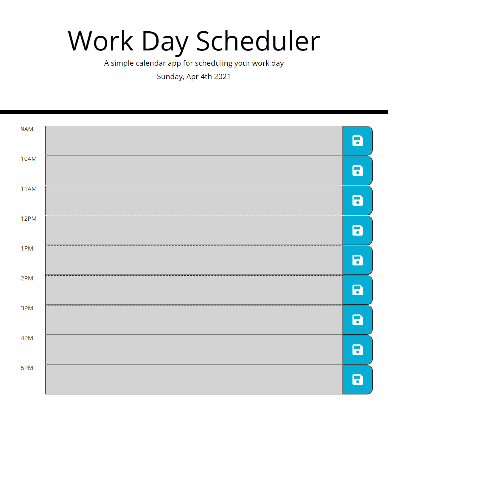

# 05-Work-Day-Scheduler
## Description
The task of this project was to create a simple coding quiz using vanilla Javascript code.  I created the index.html, styles.css, and script.js from scratch.  

**Links**

* [Deployed Webpage](https://danringenbach.github.io/04-Code-Quiz/ "Deployed Webpage")
* [Repository Link](https://github.com/DanRingenbach/04-Code-Quiz "Repository Link")

**Screenshot**
 
 
 
 